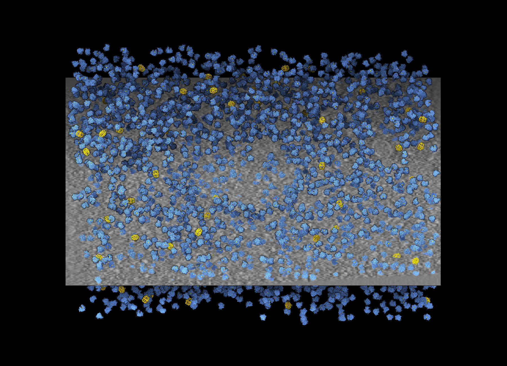
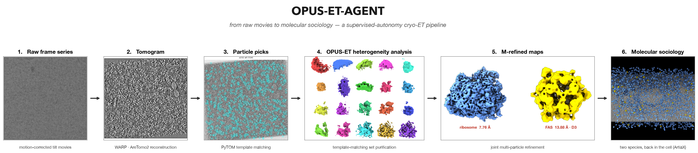
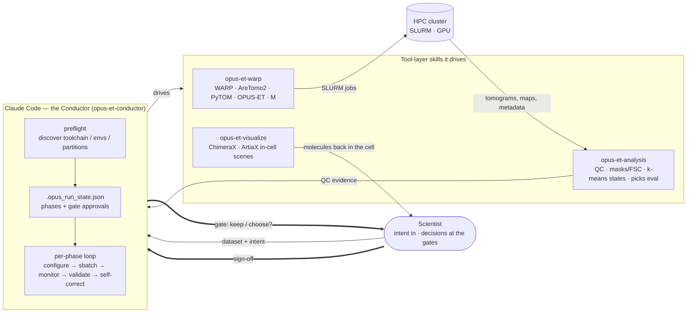
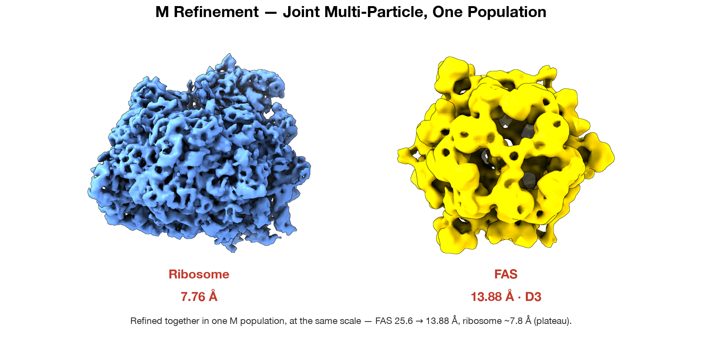
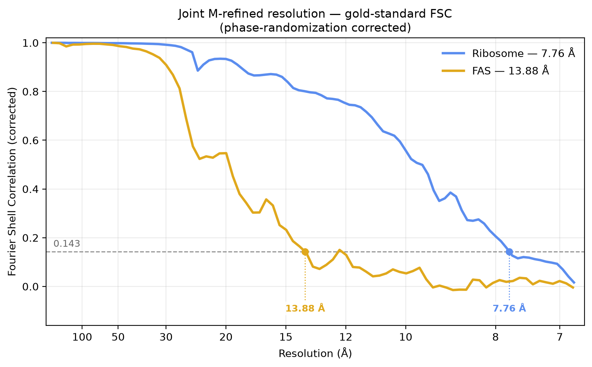
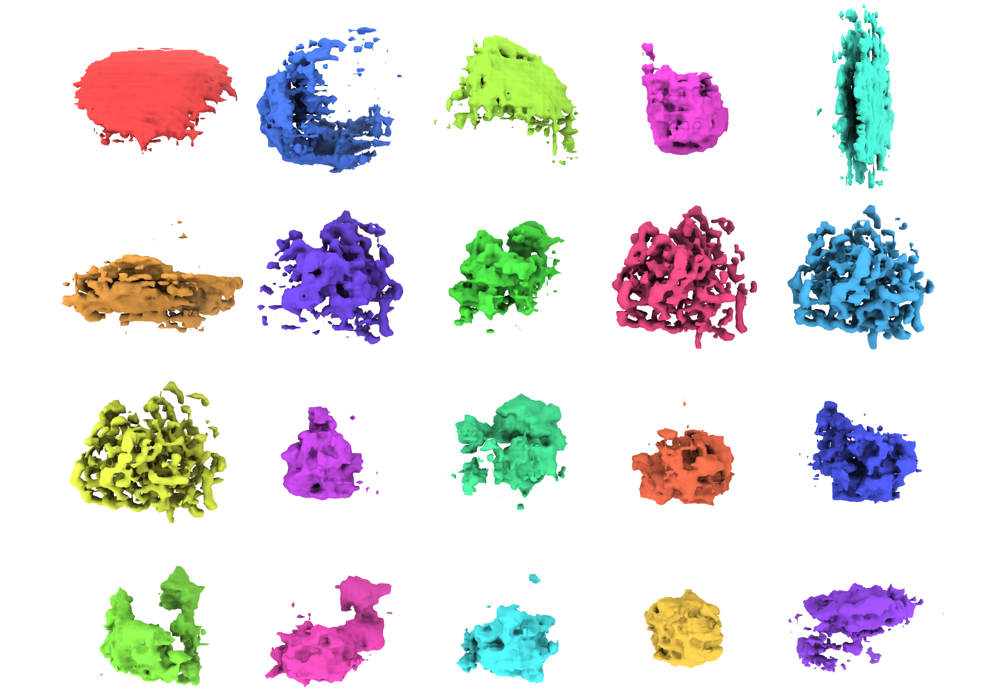
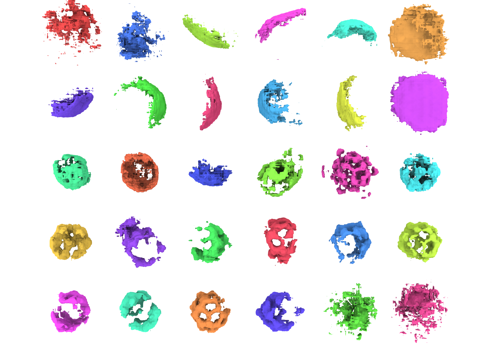

# OPUS-ET-AGENT — agentic cryo-ET pipeline

A supervised-autonomy **conductor** (Claude Code) that drives the cryo-ET reconstruction
pipeline end-to-end — **WARP → AreTomo2 → PyTOM → OPUS-ET → M** — pausing at each scientific
**gate** for a human sign-off, self-correcting known failures, and mapping the refined molecules
back **inside the cell** (ChimeraX/ArtiaX). Built on top of a set of great cryo-ET data-processing
software — **WARP/M**, **AreTomo2**, **PyTOM**, **OPUS-ET**, **ChimeraX**, and **ArtiaX**.

<p align="center">
  <br>
  <sub><em>The payoff — every ribosome (blue) and fatty-acid synthase (gold) placed back at its pose inside one real cell: <b>molecular sociology</b>, read straight off the data.&nbsp; ▶ <a href="demo/README.md#gate5">watch it rotate</a></em></sub>
</p>

## The task — and why it matters

**Cryo-electron tomography (cryo-ET)** is the only technique that resolves macromolecules at
near-molecular detail *inside intact cells* — structural biology *in situ*, where you see not just
a molecule's shape but **where it sits and who it sits with** ("molecular sociology"). Getting
there means turning raw tilt-series — dose-fractionated movies of a frozen cell tilted in the
microscope — into 3D density maps of the molecules within: motion/CTF correction, tilt-series
alignment, tomogram reconstruction, particle picking, per-particle heterogeneity analysis, and
multi-particle refinement. That pipeline is long and fragile, spans half a dozen specialist
packages, and is gated by expert judgment at nearly every step — which is why in-cell structural
biology stays expensive and low-throughput.

**This project puts an AI agent in the driver's seat.** Claude Code runs the whole chain
end-to-end with *supervised autonomy*: it discovers the toolchain, configures and submits the
cluster jobs, runs the QC at each stage, and — crucially — **stops at each scientific checkpoint
and hands the decision to a human**, backing that decision with the evidence it computed. The
payoff is in the results: on a real dataset ([EMPIAR-10988](https://www.ebi.ac.uk/empiar/EMPIAR-10988/))
it drove **two** molecular species to high resolution at once — the **ribosome to 7.76 Å** and
**fatty-acid synthase to 13.88 Å** — and mapped both back into the cell as *molecular sociology*.
Why it matters: a weeks-long, expert-only workflow becomes a reproducible, test-covered,
agent-driven one that still keeps the scientist in command of every call that matters — and
mapping molecules back into the cell turns isolated structures into a map of *who sits next to
whom*, where the crowding, exclusion zones, and neighbour relationships that purified structures
can't show make subtler in-cell molecular mechanisms discoverable.

**The whole arc at a glance** — raw movies → tomogram → picks → OPUS-ET states → M-refined maps →
the two molecules mapped back into the cell:



## The gates

The agent runs the judgment-support work; the human holds the decision.

1. **Gate 1 — alignment QC** — one QC agent per tomogram (parallel), reconstruction slices + a
   WARP↔AreTomo handedness check.
2. **Gate 2 — picks QC** — template-matching picks scored + overlaid; runs on **two species**
   (ribosome and FAS) from one reconstruction set.
3. **Gate 3 — state selection** — OPUS-ET latent states judged by four converging, mostly
   template-free signals (the sharpest maps are the ones a naive template score ranks worst).
4. **Gate 4 — resolution** — gold-standard half-map FSC with the phase-randomization correction,
   plus a **mask–density overlay** that *shows* the mask wraps the molecule without clipping.
5. **Gate 5 — joint M refinement** — both species in one M population; multi-particle refinement
   solves the shared tilt-series model with every particle at once (**FAS 25.6 → 13.88 Å**).

## Components

- **opus-et-warp** — reconstruction engine (WARP / AreTomo2 / PyTOM / OPUS-ET / M), SLURM.
- **opus-et-analysis** — interpretation + QC tools (mask/FSC, k-means states, map consistency, pose parsing).
- **opus-et-conductor** — orchestration brain: run-state, checkpoints, monitor/diagnose loop.
- **opus-et-visualize** — in-cell ChimeraX/ArtiaX scenes (each map placed at every pose, colored by state/species).

## Architecture

Supervised autonomy: the conductor runs the machinery and computes the evidence; the scientist
makes every judgment call, at five gates.



**Gates:** 1 alignment QC · 2 picks QC · 3 state selection · 4 resolution · 5 joint-M refinement.

## Getting started

**What this is.** OPUS-ET-AGENT is four [Claude Code](https://code.claude.com/docs) **Agent Skills** — not a standalone program. The "app" is Claude Code itself: you describe your dataset in plain language, and Claude Code, driving these skills, runs the pipeline and pauses at each gate for your sign-off. `opus-et-conductor` orchestrates the other three (`opus-et-warp`, `opus-et-analysis`, `opus-et-visualize`).

**Prerequisites**
- [**Claude Code**](https://code.claude.com/docs) — the agent that runs the skills.
- **For a real run** — an HPC cluster (SLURM + GPUs) with the cryo-ET toolchain the skills drive: **WARP** (the [`alncat` fork](https://github.com/alncat/warp), required for `--dont_correct_ctf_3d` / `--output_ctf_csv`), **AreTomo2**, **PyTOM**, **OPUS-ET** (`dsdsh`), and **M** (`MTools` / `MCore`), each in its conda env. The conductor's preflight probes for these and reports whatever is missing — it does not install them.
- **For the in-cell finale** — a local **ChimeraX 1.10 + ArtiaX 0.7.0** desktop (the render runs locally, not on the cluster).

**Install the skills.** Clone the repo and make the four skill directories discoverable by Claude Code — a skill is just a folder with a `SKILL.md`, auto-discovered from `.claude/skills/` (this project only) or `~/.claude/skills/` (everywhere). No registration step. Symlink (shown) or copy each in:

```bash
git clone https://github.com/alncat/opus-et-agent.git
cd opus-et-agent
mkdir -p .claude/skills
for s in opus-et-conductor opus-et-warp opus-et-analysis opus-et-visualize; do
  ln -s "../../$s" ".claude/skills/$s"   # or: cp -r "$s" ".claude/skills/$s"
done
```

**Run it.** Open Claude Code in your working directory and hand off the dataset — the conductor takes it from there:

> *"I have a cryo-ET dataset to process end-to-end, on my `<cluster>` cluster; frames + acquisition MDOCs are under `<DATA_DIR>`. Use the OPUS-ET conductor: preflight the toolchain, auto-detect the acquisition parameters, write and validate `pipeline.conf`, and begin the pipeline — pausing at each scientific checkpoint for my sign-off."*

Progress lives in `.opus_run_state.json`, so a fresh Claude Code session resumes from disk, not from chat history. The full per-gate walkthrough — with the exact prompts for each checkpoint — is in [`demo/video_script.md`](demo/video_script.md).

**Try it without a cluster.** The QC / analysis / viz tools are plain Python and test-covered — run the suite and browse the results bundle:

```bash
python3 -m venv .venv && .venv/bin/pip install -r requirements-dev.txt
.venv/bin/pytest          # 187 tests, all green
```

[`demo/README.md`](demo/README.md) tells the figure-by-figure scientific story.

## Results & demo

**Two molecules, resolved together and mapped back into the cell.** With one config change and no new code, the same pipeline drove a ribosome to **7.76 Å** and the far rarer fatty-acid synthase to **13.88 Å**, refined jointly in a single M population. *(Click any figure to jump to its full write-up in the [results bundle](demo/README.md).)*

<p align="center">
  <a href="demo/README.md#gate5"></a><br>
  <a href="demo/README.md#gate5"></a>
</p>

At **Gate 3**, OPUS-ET's latent space is clustered into 20 compositional states; the agent brings four converging, mostly template-free signals to name the genuine high-resolution core instead of trusting one biased score:

<p align="center">
  <a href="demo/README.md#gate3"></a>
</p>

The **same workflow generalizes to a second species, zero code changes.** Fatty-acid synthase is far sparser, so its latent space is clustered into 30 states — most are junk, and the clean **D3 barrels** (with their 3-fold central pore) stand out as the real high-resolution population:

<p align="center">
  <a href="demo/README.md#gate3b"></a><br>
  <sub><em>The rarer molecule, same honest playbook — see the D3 barrels emerge from the junk clusters. <a href="demo/README.md#gate3b">Full write-up →</a></em></sub>
</p>

- **[demo/README.md](demo/README.md)** — the curated results bundle (Gates 1–5), figure by figure.
- **[demo/video_script.md](demo/video_script.md)** — the ≤3:00 demo-video **script** (story + shot list + how to capture, in one doc).

## Future directions

**State-resolved molecular sociology.** OPUS-ET's distinctive power is resolving each particle's
conformational/compositional **state**; the natural next step is to carry that per-particle state
into the in-cell map — colouring every placed molecule not just by *where* it sits but by *what
functional state it's in there*. Combining position with state turns the finale from a map of
locations into a map of *behaviour* — which ribosomes are actively translating and where, which
assemblies are engaged vs. idle — the biological context you can only read when you know both a
molecule's place and its state. Deeply integrating OPUS-ET this way is how OPUS-ET-AGENT delivers
progressively richer biological context over time.

## Acknowledgements

- **Anthropic** — for sponsoring this hackathon and for Claude; Claude Code drove the entire
  pipeline and built every tool here.
- **MRICS** — for the HPC compute this work ran on.
- **J. Mahamid lab** — for the cryo-ET dataset ([EMPIAR-10988](https://www.ebi.ac.uk/empiar/EMPIAR-10988/)).
