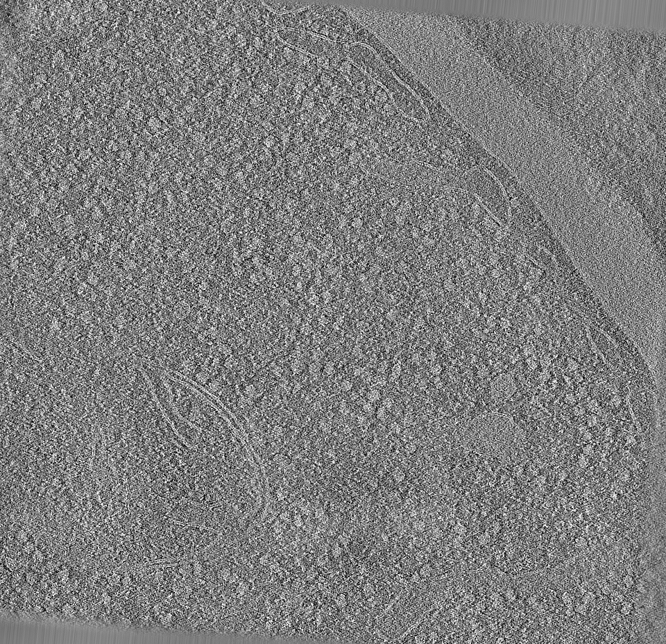
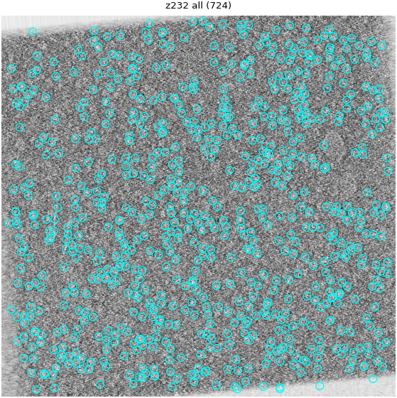
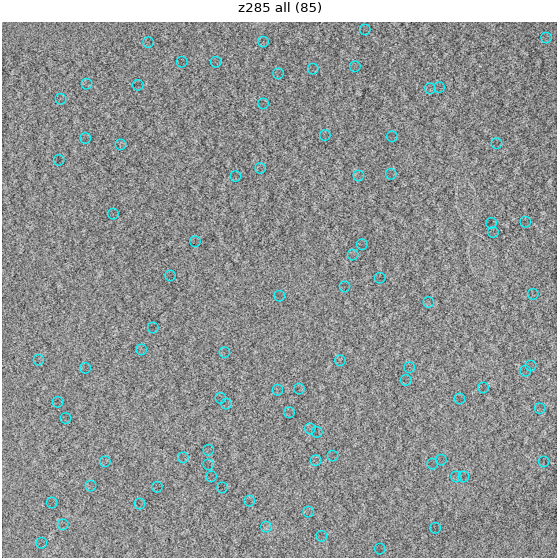
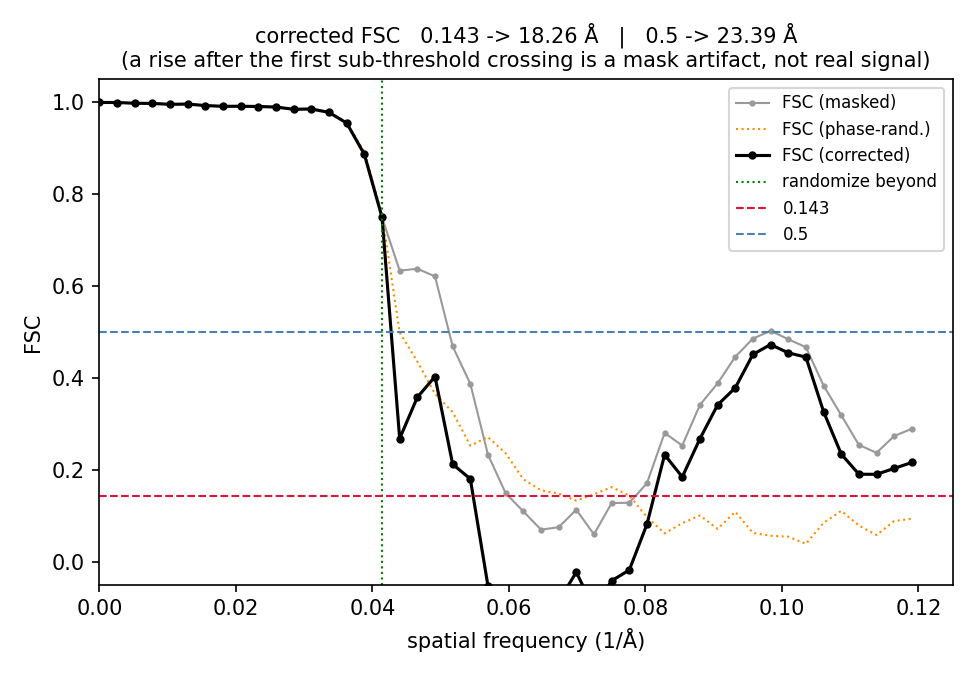
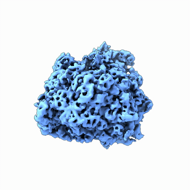
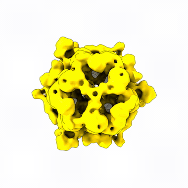
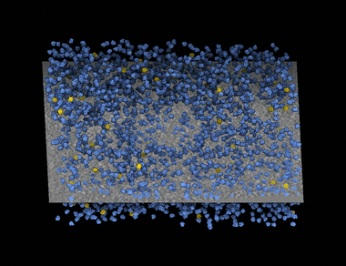
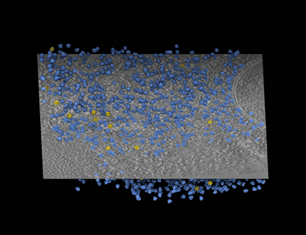
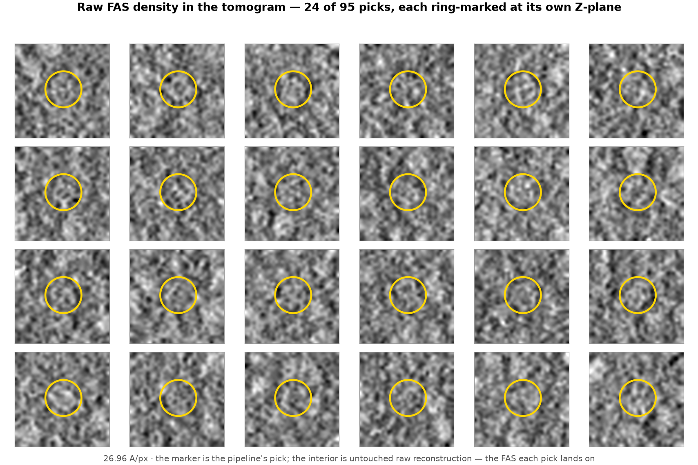
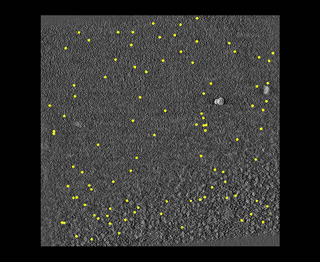

# Demo Results — OPUS-ET-AGENT (agentic cryo-ET pipeline)

Curated results from the conductor driving the cryo-ET pipeline
(WARP → AreTomo2 → PyTOM template matching → OPUS-ET) end-to-end on a real
10-tilt-series dataset, with human checkpoints ("gates") and automated QC.

The full pipeline ran **fully autonomously from raw movies to reconstruction**
(10/10 tilt series → tomograms at 960×928×500, 13.48 Å/px), then through
template matching, picks QC, **OPUS-ET heterogeneity training, and
compositional-state selection** — run independently for **two species**
(ribosomes and fatty-acid synthase) — and on into **M**, where both molecules
are imported into one shared population and refined jointly, all under
supervised-autonomy gates.

**The whole arc at a glance** — raw movies → tomogram → picks → 3D states → the
two molecules mapped back into the cell:

> Reproduce: cluster panels via `demo/render_commands.md` §C, then
> `python demo/gen_process_strip.py` composes the strip.

---

## Gate 1 — Alignment / reconstruction QC  (`qc/gate1_alignment/`)

Central-slice previews (`slice_preview.py`) confirm each tomogram reconstructed
cleanly, plus a WARP↔AreTomo handedness check. All 10 passed.

*XY central slice of a reconstructed tomogram (TS_034): lamella, membranes, and a dense,
ribosome-bearing cytoplasm — real in-cell context, not a blank slab. All 10 tomograms passed QC.*

| File | What it shows |
|------|---------------|
| `TS034_recon_xy.png` | XY central slice — lamella, membranes, dense cytoplasm |
| `TS034_recon_xz.png` | XZ slice — slab thickness, no gross reconstruction artifacts |
| `handedness_TS_026.png` | WARP vs AreTomo handedness agree (no Z-flip) |
| `gate1_metrics.tsv` | Per-tomogram dims / intensity stats / XY-match flag (all "yes") |

---

## Gate 2 — Template-matching picks QC  (`qc/gate2_ribosome_picks/`)

Ribosome picks overlaid on tomogram z-slabs by **`tm_picks_overlay.py`** — a new
QC tool built this project. Each slab (~1 particle thick) renders **all** in-slab
picks and the **top-N by score**. This is the visual companion to
`tm_eval_agreement.py`, which scored the picks numerically.

**Numeric result:** on the richest tomogram (TS_034), TM recovered **100% of the
curated reference set — recall 1.000 (2445/2445 `sel30` picks)** — decisively
validating the template contrast, mask, and coordinate frame.

*Ribosome template-match picks on a TS_028 z-slab: they blanket the ribosome-rich cytoplasm and
avoid the empty lumen. The QC also discriminates — on the poor tomogram TS_041 the top-scoring
picks instead land on a carbon/ice edge (`TS041_poor_top200_on-artifacts.png`), a clear "exclude" signal.*

| File | What it shows |
|------|---------------|
| `TS028_good_all-picks.png` | **Good tomogram** — picks blanket the ribosome-rich cytoplasm, avoid the empty lumen |
| `TS028_good_top200.png` | Top-200-by-score — strongest picks on discrete ribosomes |
| `TS034_recall1.0_all-picks.png` | The recall-1.0 validation tomogram |
| `TS041_poor_all-picks.png` | **Poor tomogram** — sparse, scattered picks; low contrast + contamination |
| `TS041_poor_top200_on-artifacts.png` | **The discriminator:** TS_041's *top* picks land on the carbon/ice edge + a vesicle, not ribosomes — a clear "exclude this tomogram" signal |

The pair (good vs poor) shows the tool does what a QC tool must: make good-vs-bad
picking obvious at a glance, and surface artifact-dominated tomograms via the
top-N view.

---

## Gate 2b — Second species (FAS), same tomograms  (`qc/gate2_fas_picks/`)

To show the tools generalize, the same 10 tomograms were re-searched for a
**second, much sparser species — fatty-acid synthase (FAS)** — using a different
template, mask, and wedge, and a per-tomogram cap of 600 candidates (vs thousands
for ribosomes). Template matching onward is namespaced by `TM_LABEL`, so both
species share one reconstruction set and run independently.

**Numeric result (all 10 tomograms, vs the curated `pre1630` reference,
`fas_eval_all.tsv`):** **overall recall 0.973 — 393/404** curated FAS particles
recovered; per-tomogram recall **0.889–1.000**, with best-F1 score thresholds
tightly clustered (**0.21–0.28**) across every tilt series — evidence the template
contrast and coordinate frame are consistent tomogram-to-tomogram. TS_028 alone:
**recall 0.989 (92/93)**.

Precision reads low on the sparse tilt series **by construction**: the reference
is a *curated subset*, and we deliberately over-extract 600 candidates per
tomogram to guarantee recall for a rare species, so most extra picks scored as
"false positives" are simply un-curated — precision is a lower bound, recall is
the headline (see `tm_eval_agreement.py` docstring).

*The same three tools on a rarer molecule — FAS picks on a TS_028 z-slab (recall 0.989): sparser
and smaller than ribosomes, distributed through the cytoplasm. Overall recall 0.973 across all 10
tomograms, a new species config, zero code changes.*

| File | What it shows |
|------|---------------|
| `TS028_fas_recall0.989_all.png` | All in-slab FAS picks — distributed through the cytoplasm, sparser and smaller than ribosomes |
| `TS028_fas_top100.png` | Top-100-by-score — the highest-confidence FAS picks |
| `TS030_fas_cytoplasm_all.png` | **Spatial specificity** — picks fill the dense cell interior and avoid the empty compartment (lower-right), following cellular structure |
| `fas_eval_all.tsv` | Per-tomogram n_cand / n_ref / TP / recall / best-F1 / threshold for all 10 |

Same three tools (`tm_auto_mask` → `tm_picks_overlay` → `tm_eval_agreement`), a
new species config, zero code changes — a 0.97-recall pick set on a rare complex.

---

## Gate 3 — Heterogeneity + compositional-state selection  (`qc/gate3_states/`)

The ribosome picks fed **OPUS-ET** heterogeneity training on **58,000 subtomograms** at the
corrected **4.2 Å** subtomogram pixel size (latent dim 8) — the pick-more–expanded set
(+8k particles from the ribosome-dense tomograms), warm-started from the base run's epoch-25
checkpoint. The latent space was clustered into **20 k-means states**
(`analyze_opuset.slurm` → `dsdsh analyze` + `eval_vol`), each reconstructed as a 3D density
map. **Which states are real ribosomes?** — the Gate 3 judgment call.

We answer it with **four signals** — and the point is how they *disagree*, then converge:

1. **Template correlation** (`compare_to_template.py`) — masked CC of each state map to the
   ribosome **template** + **internal consensus**. It cleanly **rejects junk** (the bottom
   states k0/k2/k1/k3/k7 are near-empty slabs and carbon/ice-edge half-fields — low CC *and*
   tiny, 242–386 particles). But it is **biased against resolution**: the sharpest maps
   correlate *less* with the blurry low-res template, so **k17/18/19 rank dead last by
   `cc_template` (0.012–0.013)** — beneath the smooth blobs. Template-CC alone would throw the
   best states away.
2. **3D resolution/detail** (`ribo_state_gallery_3d.png`, `--percentile 98` contour) — in 3D,
   **k17/18/19 are unmistakably the highest-resolution states**: discrete subunit granularity,
   the classic two-lobed ribosome. The high-`cc_consensus` states (k9/k13/k16, 0.87–0.93) are
   smoother, lower-resolution ribosomes. Resolution is only visible in 3D — never trust the CC
   number over the map.
3. **Latent UMAP** (particle-space, template-free) — **k17/18/19 form a cleanly separated
   island**, well away from the smooth-blob main manifold. Within it, **k18/k19 are the core**;
   **k17 is the transitional member** that bridges toward the manifold (and is the most distinct
   map, `cc_consensus` 0.57).
4. **N×N map-to-map consistency** (`state_consistency.py`, template-free) — at full resolution
   **k18/k19 are a tight pair (mutual CC 0.94)** with **k17 a looser affiliate (0.74–0.82)**;
   junk are the clear outliers. Low-passing to 30 Å **erodes** the separation — reproducing the
   template-CC bias and confirming the *raw* map-to-map table is the trustworthy view.

**What the signals say together:** **k18/k19 are the unambiguous high-resolution core**, with
**k17 a genuine but transitional high-res ribosome** (distinct in latent space, looser map
consistency). The agent surfaces **four converging measurements instead of one biased score**;
the **human kept k17/18/19 (14,797 particles)** → `sel_ribo.star`. The headline: **the three
sharpest maps in the whole set are exactly the ones the naive template score ranks worst** —
the reason Gate 3 exists.

*The 20 k-means compositional states (fair golden-angle coloring, 98th-percentile contour).
Bottom-right **k17/18/19** are visibly the highest-resolution maps — discrete subunit
granularity — yet the naive template-CC ranks them dead last. That inversion is the whole point.*

`state_tomo_stats.py` also closes the **pick-more loop**: the four tomograms whose cap we
raised (**TS_028 42%, TS_034 35%, TS_030 33%, TS_029 30%** of picks in the selected core) are the
four densest cells — the cap-raise targeted exactly the ribosome-rich tomograms, and they stay
the densest even after raising the cap.

| File | What it shows |
|------|---------------|
| `ribo_state_gallery_3d.png` | ChimeraX isosurfaces of all 20 states (fair golden-angle coloring, 98th-pct contour); **bottom-right k17/18/19** visibly the finest density |
| `ribo_latent_umap_states.png` | Per-particle latent UMAP by state — **k17/18/19 (cyan/gold/purple) a cleanly separated island**; k17 bridges toward the manifold |
| `ribo_states_vs_template_montage.png` | Central slices of all 20, labeled `cc_template` \| `cc_consensus` — the sharp k17/18/19 sit at the *bottom* of `cc_template` |
| `ribo_state_consistency_raw.png` / `_lp30.png` | **N×N map-to-map consistency** (raw + 30 Å) — k18/19 a tight block, k17 a lighter affiliate; the separation erodes when low-passed |
| `ribo_gate3_tomo_stats.png` | Per-tomogram selected fraction — the cap-raised TS_028/034/030 flagged as densest |
| `ribo_state_consistency_matrix.tsv`, `state_vs_template_scores.tsv` | The full numeric tables |

---

## Gate 4 — Resolution (gold-standard FSC)  (`qc/gate4_resolution/ribo_fsc_corrected.png`)

The selection was pushed to a gold-standard map: `sel_ribo.star` split into two independent
halves, each reconstructed in **fixed mode** (`train_opuset_fixed.slurm`), then a molecule mask
derived from the density (`gen_mask_from_map.py`, not a sphere) and the half-map **FSC** measured
(`compute_fsc.py`). The FSC carries a **phase-randomization correction** (RELION high-resolution
noise substitution): phases beyond the masked-FSC-0.8 shell are randomized, the same mask
re-applied, and the mask-induced correlation subtracted off — the honest resolution once the
mask artifact is removed.

**Corrected FSC = 18.26 Å at 0.143** (masked, uncorrected 16.69 Å). This ~18 Å map is the
**low-resolution starting model imported into M**, which refines tilt-series alignment and
per-particle poses from there — the high-frequency detail is M's job, not this half-map's.

*The gold-standard half-map FSC: masked, phase-randomized, and the honest **corrected** curve —
0.143 crossing at 18.26 Å. Correcting for the mask-induced correlation is what keeps the reported
resolution from being flattered; this ~18 Å map is the starting model M refines from.*

Because the FSC is only honest if the mask *follows the molecule*, the checkpoint also **shows the
mask, not just trusts it**: `gen_mask_from_map.py --qc` overlays the derived mask envelope on the
density in three orthogonal central slices. The mask wraps each molecule snugly without clipping —
and the FAS overlay makes the **D3 barrel symmetry** visible directly (a six-lobed rosette in XY,
the hollow stacked rings in XZ/YZ).

| File | What it shows |
|------|---------------|
| `ribo_fsc_corrected.png` | Masked / phase-randomized / corrected FSC curves + the 0.143 & 0.5 thresholds |
| `ribo_fsc_corrected.tsv` | Per-shell freq / resolution / masked / randomized / corrected FSC |
| `ribo_mask_overlay.png` | **Mask–density overlay QC** — the mask envelope (red) hugs the ribosome across XY/XZ/YZ, no clipping (enclosed fraction 0.17) |
| `fas_mask_overlay.png` | The same QC for FAS — the mask follows the **D3 barrel**, its hollow interior visible inside the envelope |

The takeaway: **one correlation-to-template score was misleading; four converging, mostly
template-free signals pinpoint the real high-res core *and* honestly flag the one ambiguous
cluster.** That is the agent's Gate-3 job — surface the evidence and its disagreements, leave
the scientific call to the human.

---

## Gate 3b — FAS heterogeneity + state selection

The FAS picks (Gate 2b, recall 0.973) fed their **own OPUS-ET heterogeneity run** — the same
code, a **D3-symmetry-expanded training set** built around the barrel's own symmetry axes, no
architecture changes. Because FAS is far sparser than ribosomes, its latent space was clustered
into **30 k-means states** instead of 20 — finer granularity over a smaller particle pool.

The **same four-signal Gate-3 workflow** (`compare_to_template.py`, 3D isosurface detail, latent
UMAP, `state_consistency.py`) was pointed at the FAS states, unmodified. It reproduced the same
shape of result as ribosomes: template correlation alone is biased toward smooth, low-res blobs,
while 3D detail, latent separation, and map-to-map consistency converge on isolating the **real
high-resolution D3 barrel state** from the smoother/junk clusters — the identical honest playbook,
run on a structurally different, much rarer molecule.

*FAS's 30 k-means compositional states (same fair-coloring rule as the ribosome gallery — never
highlight a subset). Most are smeared or partial; several resolve the clean **D3 barrel with its
3-fold central pore** — the genuine high-resolution population the four-signal workflow isolates
from the junk. Exactly why a sparse species is clustered at a higher k than the ribosome's 20.*

The chosen FAS state was carried into **fixed-mode reconstruction** the same way as the ribosome
(half-map split, `train_opuset_fixed.slurm`). Symmetry gives a meaningful before/after: the
**D3-symmetrized halves reach ~25.6 Å (corrected FSC, 0.143)**, while the **C1 (unsymmetrized)
fixed-mode reconstruction is ~31.5 Å** — symmetry averaging recovers real signal, exactly what's
expected for a genuine D3 assembly rather than an artifact.

**The point:** zero new code, zero shortcuts — the same four converging, mostly template-free
signals that found the ribosome's high-res core find FAS's high-res barrel too, on a second,
much rarer molecule.

---

## Gate 5 — Joint multi-species M refinement

Both species now converge into **M**, WARP's downstream refinement engine, as **one shared
population**: `population1` = `ribo_11ea1073` + `fas_89b38e4c` — the ribosome and FAS particle
sets, each carrying its own low-resolution Gate-4-style starting map, imported side by side into
a single M project rather than two independent ones.

This is **multi-particle refinement**: `MCore` doesn't solve each species' geometry separately —
it refines **one shared per-tilt-series alignment and CTF model using every particle from both
species at once**. The abundant ribosomes (14,797 particles) dominate the per-tilt-series
signal and pin down the shared geometry; the far sparser FAS particles ride on that same
refined model and sharpen their own poses/defocus on top of it — resolution FAS could not reach
refining alone.

The joint `warp_m_refine` pass on `population1` (`--refine_imagewarp 4x4 --refine_particles
--ctf_defocus`) lands the payoff — **per-species resolutions from the run, not a combined
number**:

| Species | Standalone | Joint pass 1 | **Joint, converged (6 passes)** |
|---------|-----------|--------------|----------------------------------|
| Ribosome | 7.69–7.76 Å (solo M plateau, box Nyquist ~6.74 Å) | 8.14 Å | **7.76 Å** — holds at plateau |
| FAS | ~25.6 Å (D3 fixed-mode) / ~31.5 Å (C1) | 16.79 Å | **13.88 Å** |

Across joint `warp_m_refine` passes FAS improves monotonically (16.79 → 16.15 → 14.60 → 14.13 →
13.92 → **13.88 Å**) while the ribosome holds flat (…7.75 → 7.76 → 7.76 Å) — passes 5–6 confirm
the plateau (Δ < 0.05 Å/pass, converged). The figures below use the converged (pass-6) maps.
FAS gains **~12 Å** by joining the ribosome's
population: the 14,797 ribosomes anchor the shared tilt-series geometry/CTF, and the far sparser
FAS refines on top of a model it could never constrain alone — exactly the multi-particle-
refinement thesis. The ribosome gives up nothing measurable to carry the second species.

> The gold-standard FSC that backs those numbers — phase-randomization-**corrected** (the same
> honest basis as the Gate-4 curve), read straight off the joint-M half-maps: the ribosome
> crosses 0.143 at **7.76 Å** and FAS at **13.88 Å** (curve data in `qc/finale/m_refined_fsc.tsv`;
> regenerate with `demo/finale/build_m_fsc.py` from the `m/species/<hash>/<species>_fsc.star` files).

The same two maps, rotating — the **7.76 Å ribosome** (rRNA helices resolved) and the **13.88 Å FAS D3 barrel**:

  
  &nbsp;&nbsp;
  

> Plain-ChimeraX turntables (contour ≈ mean+4σ, speckle removed, shadowed on white); driver
> `demo/finale/build_map_spins.py`. Full-resolution `.mp4` versions sit alongside the GIFs in `qc/finale/`.

The refined maps map **back into the tomogram** — every particle's pose populated with its
species' density, the two molecules in their true cellular arrangement (**molecular sociology**):

> The gentle rock, autoplaying above (full-resolution [`finale_insitu.mp4`](qc/finale/finale_insitu.mp4) is in the repo — GitHub can't preview mp4 inline, so download it for full quality). Rendered locally in ChimeraX 1.10 + ArtiaX 0.7.0 — 3,387 ribosomes (blue) + 95 FAS (gold) at
> their TS_028 poses; the motion is the gentle rock (tilt + shadows +
> silhouettes, the same hero aesthetic as the TS_029 companion below). Reproduce via
> `gen_artiax_scene.emit_cxc(..., tilt_x=-55, silhouettes=True, movie_rock=30, movie_step=3)` — silhouettes only, no shadows (they hang on thousands of instances), `demo/render_commands.md` §B.

TS_028 is ribosome-dense but its cytoplasm is near-uniform. To show the same molecules in **richer
cellular context**, the companion render uses **TS_029** — chosen by cross-referencing organelle
content against particle count (1,825 ribosomes, and a large membrane-bound organelle):

> The **1,825 ribosomes** (blue) crowd the cytoplasm but visibly **exclude the organelle** — the
> clean round membrane arc on the right — while the 38 FAS (gold) mark the rare second species. The
> ribosome-exclusion boundary is molecular sociology reading straight off the map: the pipeline's
> poses, dropped back into a real cellular scene. Full-resolution [`insitu_TS029.mp4`](qc/finale/insitu_TS029.mp4)
> in the repo; recipe in `demo/render_commands.md` §B3, driver `demo/finale/build_ts029_cell_scene.py`.

The finale places the *refined* FAS map (idealized). The inverse view **reveals the raw density**
the picks land on — each of the 95 FAS in TS_028 zoomed to its own Z-plane, ring-marked so the raw
reconstruction inside stays visible (`particle_gallery.py`):

> A ring marks the pipeline's pick; the interior is untouched raw reconstruction — the FAS particle
> each pick lands on. `qc/finale/fas_raw_context.png` is the whole-slice overview (where in the cell).
> This is the honest "is it really there?" check for a rare species — and the reusable
> `particle_gallery.py` tool (20 tests) that produces it.

> Stepping the slice through Z: each FAS barrel appears under its marker as its plane comes into
> focus (full-resolution [`fas_TS028_scan.mp4`](qc/finale/fas_TS028_scan.mp4) in the repo).

---

## Pipeline self-correction & optimization

The agent doesn't just execute — it **keeps the pipeline correct and improves the result**:

- **Optimized the pick set per tomogram.** A uniform 5,000-candidate cap truncates the *densest*
  tomograms (`state_tomo_stats.py`: TS_028 42%, TS_034 35% of picks landing in the selected high-res core).
  The agent re-picks only those tomograms at a higher cap — reusing the existing template-match
  scores, no re-search — and **warm-starts** OPUS-ET from a mid-training checkpoint (10 epochs,
  not a 40-epoch retrain), folding ~8,000 more particles into the set (50k → 58k).
- **Kept the neural CTF at the correct pixel size.** OPUS-ET computes its CTF at `--angpix`, which
  must be the *exported subtomogram* pixel size (4.2 Å), **not** the raw tilt-series size (3.37 Å) —
  a value that silently mis-scales every CTF zero with *no error message*. Getting it right lifted
  SNR² 0.00071 → 0.00104; recorded as a reusable gotcha so it can't recur. (A supporting detail, not
  the headline — the headline is the maps.)

---

## Tools built for this pipeline (all test-covered, TDD)

Eleven analysis/QC/visualization tools were written for the gates above — **160 tests** in total,
all green. Grouped by the gate they serve:

**Gate 1 — alignment QC**
- **`slice_preview.py`** *(5 tests)* — central-slice previews (XY/XZ) + the WARP↔AreTomo
  handedness check that opens the demo.

**Gate 2 — template-matching picks QC** *(species-agnostic — same code, ribosomes and FAS)*
- **`tm_auto_mask.py`** *(18 tests)* — measures a template's radial density and auto-sizes the
  TM sphere mask (MASK_RADIUS/SIGMA) with a noise-floor threshold.
- **`tm_eval_agreement.py`** *(20 tests)* — scores TM picks vs a trusted reference by
  precision/recall/F1, reconciled in Ångströms, per-tomogram.
- **`tm_picks_overlay.py`** *(26 tests)* — the Gate 2 slice-overlay QC (all in-slab picks +
  top-N by score).

**Gate 3 — state selection**
- **`compare_to_template.py`** *(16 tests)* — the state-vs-template/consensus comparator
  (numpy-only FFT core: resample, low-pass, masked CC), flagging ribosome vs junk clusters.
- **`state_consistency.py`** *(9 tests)* — the template-free N×N map-to-map consistency table
  (hierarchically-clustered heatmap), which pinpoints the tight high-res core.
- **`state_tomo_stats.py`** *(8 tests)* — per-tomogram selected-fraction stats that close the
  pick-more loop (flag the cap-truncated dense cells).

**Gate 4 — resolution**
- **`gen_mask_from_map.py`** *(9 tests)* — derives a molecule mask from the density
  (threshold → largest connected component → soft cosine edge), not a sphere; `--qc` also emits
  a **mask–density overlay** (three orthogonal slices, mask envelope outlined) so the checkpoint
  *shows* the mask wraps the molecule without clipping.
- **`compute_fsc.py`** *(17 tests)* — gold-standard half-map FSC with the RELION
  phase-randomization correction (strips mask-induced high-frequency correlation).

**Gate 5 / finale — in-cell visualization**
- **`gen_artiax_scene.py`** *(12 tests)* — emits the ArtiaX scene placing each refined map at
  every particle pose inside its tomogram; supports **multi-species** scenes (per-particle-list
  map + contour) for the two-species finale.
- **`particle_gallery.py`** *(20 tests)* — the inverse of the finale: instead of *replacing* the
  raw density with a refined map, it **reveals** it — a per-particle zoomed gallery of raw
  reconstruction crops, each ring/transparent/solid-marked at the pick, so you see the density
  the picks land on (used for the sparse FAS species). Also emits BILD markers for the plain-
  ChimeraX scannable Z-scan reveal.

The Gate-2 trio and the Gate 3–4 tools are **species-agnostic**: the same code produced both the
ribosome and the FAS results — only the per-species config (`species_<label>.conf`: template,
mask, wedge, candidate cap) changed. Orchestration is likewise test-covered — the
`opus-et-conductor` skill's `preflight.py`, `run_state.py`, and `validate.sh --json` carry their
own suites (23 tests).

---

## Acknowledgements

- **Anthropic** — for sponsoring this hackathon and for Claude; Claude Code drove the pipeline
  end-to-end and built every tool shown above.
- **MRICS** — for the HPC compute this work ran on.
- **J. Mahamid lab** — for the cryo-ET dataset ([EMPIAR-10988](https://www.ebi.ac.uk/empiar/EMPIAR-10988/)).
